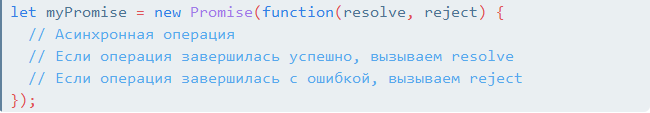
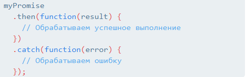
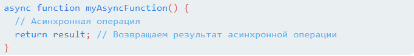
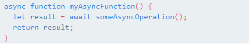
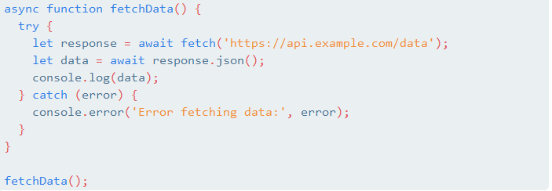
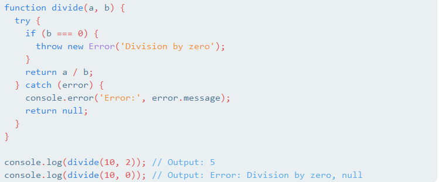
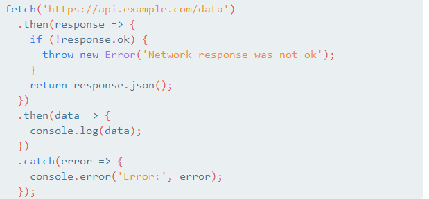

Синхронный код в JavaScript выполняется последовательно, одна команда за другой, и пока выполняется каждая операция, ничего больше не может произойти. Однако, в асинхронном коде, команды выполняются параллельно, и следующая команда может быть выполнена, даже если предыдущая еще не завершена.

Асинхронные операции в JavaScript позволяют выполнять задачи параллельно или отложенно, без блокировки интерфейса. Это достигается с помощью колбэков (callback), промисов (promises) или async/await. Например, асинхронные операции могут быть использованы для загрузки данных из сети, обработки пользовательского ввода или выполнения асинхронных задач на стороне сервера.

В JavaScript есть несколько методов для работы с асинхронным кодом, таких как setTimeout, setInterval, fetch, async/await и другие.

Например, setTimeout позволяет вызвать функцию через определенное время, а setInterval - вызывать функцию через определенные промежутки времени и fetch используются для отправки запросов на сервер и получения ответов async/await - это синтаксический сахар, который позволяет писать асинхронный код в более читаемом и понятном виде.

Надеюсь, это поможет вам лучше понять асинхронный код в JavaScript! 

### new promise

new Promise - это конструктор, который создает новый объект Promise. Объект Promise представляет собой обещание о выполнении асинхронной операции, которая может быть в состоянии "выполнено" (resolved), "отклонено" (rejected) или "ожидание" (pending).

Создание нового объекта Promise происходит следующим образом:

В этом примере функция, переданная в качестве аргумента конструктору Promise, принимает два колбэка: resolve и reject. Внутри этой функции выполняется асинхронная операция, и в зависимости от результата вызывается либо resolve, либо reject.

Объект Promise позволяет использовать цепочку методов для обработки результатов асинхронных операций, таких как then для обработки успешного выполнения и catch для обработки ошибок.

Использование объектов Promise позволяет писать более чистый и понятный код для управления асинхронными операциями в JavaScript.

async function - это синтаксический сахар в JavaScript, который упрощает работу с асинхронным кодом. Он позволяет определить функцию, которая всегда возвращает объект Promise.

Вот пример использования async function:

Ключевое слово async перед объявлением функции указывает, что эта функция будет работать асинхронно. Внутри такой функции можно использовать ключевое слово await, которое приостанавливает выполнение функции до тех пор, пока объект Promise не будет разрешен или отклонен.

Вот пример использования await внутри async function:

В этом примере await приостанавливает выполнение myAsyncFunction до тех пор, пока someAsyncOperation не завершится, после чего возвращается результат операции.

Использование async function и await упрощает написание асинхронного кода и делает его более читаемым и понятным.

async и await - это ключевые слова в JavaScript, которые используются для работы с асинхронным кодом.

Ключевое слово async используется для определения асинхронной функции. Когда функция объявлена с ключевым словом async, она всегда возвращает объект Promise. Это позволяет использовать await внутри этой функции для удобного управления асинхронными операциями.

Ключевое слово await используется внутри асинхронной функции для приостановки выполнения функции до тех пор, пока объект Promise не будет разрешен или отклонен. Это делает возможным написание асинхронного кода, который выглядит и работает как синхронный.

Вот пример использования async и await:

В этом примере fetchData - это асинхронная функция, которая использует await для ожидания завершения операции получения данных с удаленного сервера. Если операция завершается успешно, данные обрабатываются, иначе отлавливается ошибка.

Использование async и await упрощает написание и понимание асинхронного кода в JavaScript.

try и catch - это конструкции в JavaScript, которые используются для обработки и отлова ошибок.

Ключевое слово try используется для определения блока кода, в котором может произойти ошибка. Если внутри блока try возникает ошибка, выполнение блока прекращается, и управление передается блоку catch.

Ключевое слово catch используется для определения блока кода, который будет выполняться в случае возникновения ошибки в блоке try. В этом блоке можно обработать ошибку и выполнить соответствующие действия.

Вот пример использования try и catch:

В этом примере функция divide делит одно число на другое. Внутри блока try проверяется, не равно ли второе число нулю. Если это так, генерируется новая ошибка с помощью throw. Затем эта ошибка перехватывается блоком catch, и выводится сообщение об ошибке.

Использование try и catch позволяет более гибко управлять ошибками в JavaScript коде и предотвращать прерывание выполнения программы из-за ошибок.

fetch() - это функция в JavaScript, которая используется для выполнения сетевых запросов, таких как запросы на сервер для получения данных. Она предоставляет простой и гибкий способ взаимодействия с сервером.

Вот пример использования fetch() для выполнения GET-запроса на сервер:

В этом примере fetch() отправляет GET-запрос на URL 'https://api.example.com/data'. После этого используются методы then() и catch() для обработки ответа от сервера. Если ответ успешный (с кодом статуса 200), данные из ответа преобразуются в JSON с помощью response.json() и выводятся в консоль. Если происходит ошибка, она перехватывается блоком catch и выводится сообщение об ошибке.

fetch() возвращает объект Promise, что позволяет использовать цепочку методов then() для обработки успешных ответов и метод catch() для обработки ошибок.

fetch() предоставляет множество опций для настройки запросов, таких как метод запроса, заголовки и тело запроса. Она также поддерживает использование async/await для более удобного синтаксиса работы с асинхронными запросами.